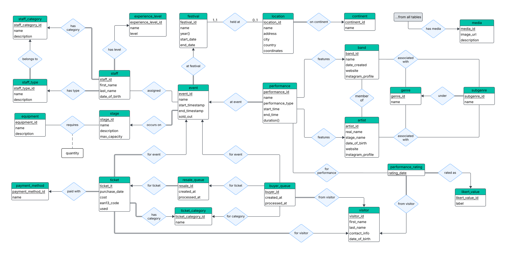
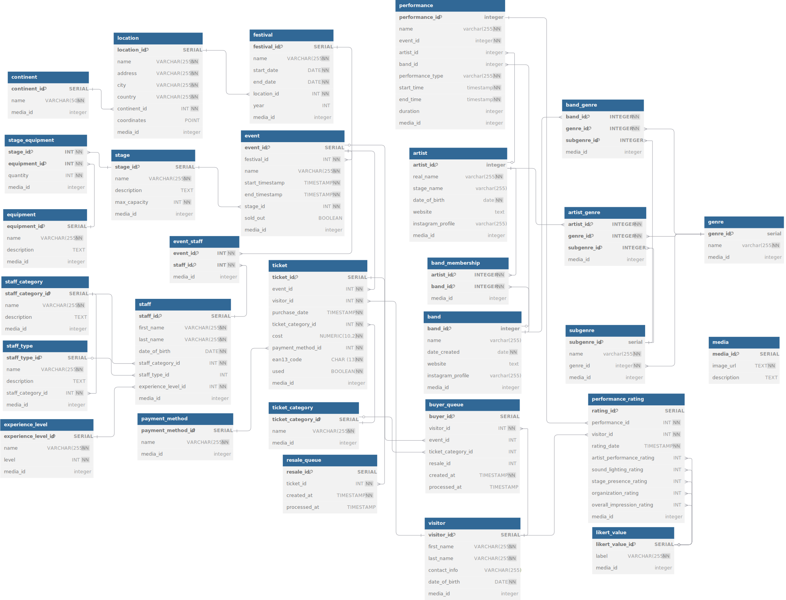

# Festival Management Database

## Overview
This project implements a **PostgreSQL** database for managing the annual **Pulse University Music Festival**. It models and manages:

- Festivals, Events & Performances
- Venue locations
- Stages & Technical equipment
- Staff assignments with role categories and experience levels
-	Artists & bands with genre and subgenre information
-	Ticketing system with purchase tracking
-	Automatic resale system with buyer-seller matching logic
-	Performance ratings based on the Likert scale
-	Media management for images and descriptions

The system includes a wide range of **constraints**, **functions**, and **triggers** to ensure the correct operation of the database and maintain data integrity and consistency throughout all use cases.

Additionally, the database is populated with essential test data (randomly generated) that enables the verification and demonstration of all major functionalities and constraints.

## ER Diagram


## Relational Diagram


## File Structure
- `diagrams/`  
  - `er.pdf`: Entity-Relationship diagram showing entities and their relationships.
  - `relational.pdf`: Relational schema diagram detailing tables, attributes, and foreign keys.

- `sql/`  
  - `install.sql`: Creates all tables, constraints, functions, triggers, and indexes.
  - `load.sql`: Inserts test/sample data into the database.
  - `Qx.sql`: SQL query files for each exercise (e.g., Q01.sql, Q02.sql, ...).
  - `Qx_out.txt`: Output of each query execution (e.g., Q01_out.txt, Q02_out.txt, ...).

- `docs/`  
  - `report.pdf`: Report with analysis, explanations, and conclusions related to the database project.

## Installation
**To set up the database:**
1.	Create a new PostgreSQL database (e.g., named festival_db).
1.	Run `install.sql` to create all tables, constraints, functions, triggers, and indexes.
1.	Run `load.sql` to populate the database with sample/test data.

**How to run the scripts (from terminal):**
```bash
psql -U your_username -d festival_db -f install.sql
psql -U your_username -d festival_db -f load.sql
```
Replace _your_username_ and _festival_db_ with your actual PostgreSQL username and database name.

> **Notes**
> - Make sure the psql command-line tool is installed and added to your system’s PATH.
> - Both `install.sql` and `load.sql` begin with `SET search_path = public, pg_catalog;` to ensure that all objects are created and accessed in the `public` schema by default. No additional schema configuration is required unless you’ve made custom changes.

**Requirements:** PostgreSQL version 14 or newer (tested on PostgreSQL 17)

## Contributors
- [Nikolaos Giannopoulos](https://github.com/giannopn)
- [Stavros Pontikis](https://github.com/stavrospod)
- [Paschalis Sarras](https://github.com/ntua-el21642)
